# -*- mode: org;  coding: utf-8; -*-
#+title: The sigla of Finnegans Wake
#+startup: shrink

* The Sigla

#+begin_quote
The sigla in Joyce’s manuscripts began as simple abbreviations for the names of characters. Certain inhabitants of FW have been recognized for a long time: Frank Budgen explains that FW only concerns a few people: H. C. Earwicker and his wife Anna Livia Piurabelle, their two sons Shem and Shaun, their daughter Issy, four old men and twelve jurors. In the manuscripts these characters bear the sigla , , , , ,  and respectively. (McHugh)
#+end_quote

#+begin_quote
I would suggest the following fourteen sigla as constituting a fundamental alphabet for future studies [...] Admittedly this is incomplete [...] Unfortunately, despite my differentiation of the sigla in this account, there is no absolute determinant as to what is, or what is not, a siglum in the manuscripts.  (McHugh)
#+end_quote

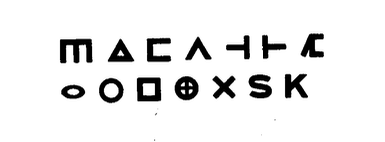

#+BEGIN_SRC text
                          
#+END_SRC

#+BEGIN_SRC text
                         
#+END_SRC

* Unicode

To encode the Sigla (and various fontly called) as part of a unicode font each requires; a code point, name, and glyph. The table below provides a starting point, situated in the Private Use Area (U+F401 to U+F471), and may eventually find it's way to somewhere in the Basic Multilingual Plane.

|------------+------------------------+---------------------+----------------------------------------------|
| *code point* | *name*                   | *glyph*               | *notes*                                        |
|------------+------------------------+---------------------+----------------------------------------------|
|            | Fundamental alphabet   |                     | McHugh                                       |
|------------+------------------------+---------------------+----------------------------------------------|
| U+F401     | SIGLUM HCE             |                   | HCE, Doodles family. 299.F4                  |
| U+F402     | SIGLUM ALP             |                   | ALP                                          |
| U+F403     | SIGLUM SHEM            |                   | Shem                                         |
| U+F404     | SIGLUM SHAUN           |                   | Shan                                         |
| U+F405     | SIGLUM ISSY            |                   | Issy                                         |
| U+F406     | SIGLUM T               |                   |                                              |
| U+F407     | SIGLUM YAWN            |                   | Shem-Shaun, Patrick, *                       |
| U+F408     | SIGLUM CIRCLE          |                   | The Twelve                                   |
| U+F409     | SIGLUM ELIPSE          |                   | The Twenty-Eight                             |
| U+F40A     | SIGLUM SQUARE          |                   | Square                                       |
| U+F40B     | SIGLUM MANDALA         |                   | Mandala                                      |
| U+F40C     | SIGLUM X               |                   | The Four                                     |
| U+F40D     | SIGLUM S               |                   | Jo                                           |
| U+F40E     | SIGLUM K               |                   | Kate                                         |
|------------+------------------------+---------------------+----------------------------------------------|
|            | Variations             |                     | grouped by context and/or appearance(?)      |
|------------+------------------------+---------------------+----------------------------------------------|
| U+F40F     | ROTATED CAPITAL F 1    |                   | 018.36                                       |
| U+F410     | ROTATED CAPITAL F 2    |                   | 121.03  (THIN?)                              |
| U+F411     | ROTATED CAPITAL F 3    |                   | 121.07  (THIN?)                              |
| U+F412     | ROTATED CAPITAL F 4    |                   |                                              |
| U+F413     | REFLECTED CAPITAL F 1  |                   | 266.22                                       |
| U+F414     | REFLECTED CAPITAL F 2  |                   | -                                            |
| U+F415     |                        |                    | -                                            |
| U+F416     |                        |                    | -                                            |
| U+F417     | ROTATED CAPITAL E 1    |                    |                                              |
| U+F418     | ROTATED CAPITAL E 2    |                   |                                              |
| U+F419     | ROTATED CAPITAL E 3    |                   | 036.xx                                       |
| U+F41A     |                        |                     |                                              |
|------------+------------------------+---------------------+----------------------------------------------|
|            | THIN variants          |                     | see: [[https://www.riverrun.org.uk/wake/index.html][A Modest Proposal]] for a Wake typeface   |
|------------+------------------------+---------------------+----------------------------------------------|
| U+F420     |                        |                     |                                              |
| U+F421     | THIN SIGLUM HCE        |                   | 119.17 "baffling chrismon trilithon sign " |
| U+F422     | THIN SIGLUM ALP        |                   | 119.19 "the smaller "                      |
| U+F423     | THIN SIGLUM SHEM       |                   |                                              |
| U+F424     | THIN SIGLUM SHAUN      |                   |                                              |
| U+F425     | THIN SIGLUM ISSY       |                   |                                              |
| U+F426     | THIN SIGLUM T          |                   |                                              |
| U+F427     | THIN SIGLUM YAWN       |                   |                                              |
| U+F428     | THIN SIGLUM CIRCLE     |                   |                                              |
| U+F429     | THIN SIGLUM ELIPSE     |                   |                                              |
| U+F42A     | THIN SIGLUM SQUARE     |                   |                                              |
| U+F42B     | THIN SIGLUM MANDALA    |                   |                                              |
| U+F42C     | THIN SIGLUM X          |                   |                                              |
| U+F42D     | THIN SIGLUM S          |                   |                                              |
| U+F42E     | THIN SIGLUM K          |                    |                                              |
| U+F42F     |                        |                     |                                              |
|------------+------------------------+---------------------+----------------------------------------------|
|            | Special and singletons |                     |                                              |
|------------+------------------------+---------------------+----------------------------------------------|
| U+F430     | MUSIC                  |                     | 044.25 (rather typeset as music?)            |
| U+F431     | MUSIC                  |          | 272.L02                                      |
|            |                        |                     |                                              |
|            |                        |                     |                                              |
| U+F433     | EUCLIDEAN FIGURE       |  | 293.12                                       |
|            |                        |                     |                                              |
|            |                        |                     |                                              |
|            |                        |                     |                                              |
| U+F434     | FW FIGURE 1            |               | 308.L17                                      |
|            |                        |                     |                                              |
|            |                        |                     |                                              |
| U+F435     | FW FIGURE 2            |               | 308.L18                                      |
|            |                        |                     |                                              |
|------------+------------------------+---------------------+----------------------------------------------|
| U+F440     | THIN RF 1              |                   |                                              |
| U+F441     | THIN RF 2              |                   |                                              |
| U+F442     | THIN RF 3              |                   |                                              |
| U+F443     | THIN RF 4              |                   |                                              |
| U+F444     | THIN RF 5              |                   |                                              |
| U+F445     | THIN RF 6              |                   |                                              |
| U+F446     | THIN RF 7              |                   |                                              |
| U+F447     | THIN RF 8              |                   |                                              |
| U+F448     | THIN ROTATED HCE 1     |                   |                                              |
| U+F449     | THIN ROTATED HCE 2     |                   |                                              |
| U+F44A     | THIN ROTATED HCE 3     |                   |                                              |
|------------+------------------------+---------------------+----------------------------------------------|
| U+F44B     | SIGLA MISC             |                   |                                              |
| U+F44C     | SIGLA MISC             |                    |                                              |
| U+F44D     | SIGLA MISC             |                    |                                              |
| U+F44E     | SIGLA MISC             |                    |                                              |
| U+F44F     | SIGLA MISC             |                   |                                              |
| U+F450     | SIGLA MISC             |                   |                                              |
| U+F451     | SIGLA MISC             |                   |                                              |
| U+F452     | SIGLA MISC             |                    |                                              |
| U+F453     | SIGLA MISC             |                   |                                              |
| U+F454     | SIGLA MISC             |                  |                                              |
| U+F455     | SIGLA MISC             |                   |                                              |
| U+F456     | SIGLA MISC             |                   |                                              |
| U+F457     | SIGLA MISC             |                   |                                              |
| U+F458     | SIGLA MISC             |                    |                                              |
| U+F459     | SIGLA MISC             |                   |                                              |
| U+F45A     | SIGLA MISC             |                    |                                              |
| U+F45B     | SIGLA MISC             |                   |                                              |
| U+F45C     | SIGLA MISC             |                   |                                              |
| U+F45D     | SIGLA MISC             |                   |                                              |
| U+F45E     | SIGLA MISC             |                    |                                              |
| U+F45F     | SIGLA MISC             |                   |                                              |
| U+F460     | SIGLA MISC             |                    |                                              |
| U+F461     | SIGLA MISC             |                   |                                              |
| U+F462     | SIGLA MISC             |                   |                                              |
| U+F463     | SIGLA MISC             |                   |                                              |
| U+F464     | SIGLA MISC             |                   |                                              |
| U+F465     | SIGLA MISC             |                   |                                              |
| U+F466     | SIGLA MISC             |                   |                                              |
| U+F467     | SIGLA MISC             |                   |                                              |
| U+F468     | SIGLA MISC             |                   |                                              |
| U+F469     | SIGLA MISC             |                    |                                              |
| U+F46A     | SIGLA MISC             |                  |                                              |
| U+F46B     | SIGLA MISC             |                   |                                              |
| U+F46C     | SIGLA MISC             |                   |                                              |
| U+F46D     | SIGLA MISC             |                   |                                              |
| U+F46E     | SIGLA MISC             |                    |                                              |
| U+F46F     | SIGLA MISC             |                   |                                              |
| U+F470     | SIGLA MISC             |                    |                                              |
| U+F471     | SIGLA MISC             |                   |                                              |
|------------+------------------------+---------------------+----------------------------------------------|

- "Mick, Nick the Maggot or whatever your name is" 399.26

* Fonts & faces

I'm aware of two previous fonts, which both use ASCII overloading (i.e. LATIN & SIGLUM are indistinguishable) to represent the sigla. [[https://fweet.org/fweet/pages/fw_font.php][Fweet Figla]] contains 18 sigla and Ian Gunn's [[https://www.riverrun.org.uk/wake/index.html][Wake typeface]] includes many more. There are also some suggestions on [[https://www.finnegansweb.com/wiki/index.php/Help:Contents][finnegansweb]] about using existing glyphs to represent the [[https://finnegansweb.com/wiki/index.php/Sigla][sigla]].

The primary advantage of unicode encoding is to enable a single font to typeset the text, accents and various sigla. It also enables the sigla to be located within the text (e.g. search by character) and uniquely identified (typographically at least).

#+caption: FweetFig.TTF font
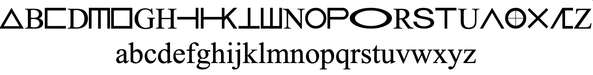

#+caption: WAKE2.TTF font
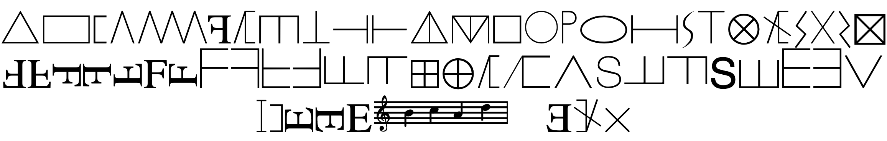

** Riverrun

The Riverrun font uses images from scanned text and glyphs from WAKE2 TTF font imported into FontForge with the unicode range from the table above.

** Blue Lagoon

To create a single font for typesetting the text and sigla, it is possible to add the glyphs from Riverrun into another font (e.g. using  'Element > Merge Font' in FontForge). The font Blue Lagoon was created by merging [[https://github.com/CatharsisFonts/Cormorant][Cormorant]] with Riverrun.

* order and appearances

#+begin_quote
Joyce’s technique of personality condensation is ultimately inseparable from his linguistic condensation. Coincidences of orthography and pronunciation are enforced with indifference to the ostensible logic of their past. That which is not coincidence is pared away, and the greater the similarity of two persons’ names, the more usefully their personalities conjugate. Before the onset of the effect I called psychic saturation, the reader’s mind dictates its own limits of credulity towards the range of different meanings that Joyce intended any word or unit to encompass. Clearly, no two people will draw the line at precisely the same point, and even the same person on different occasions will place it differently. To be strict, it is less a line than a zone of apathy dividing stimulus from vacuum. With reiterated textual experience, the limits first contract, then widen. It is however possible to ignore the aesthetic commitment and theoretically to unite any unit with any gloss,

—Roland McHugh, The sigla of Finnegans wake
#+end_quote

** page 18

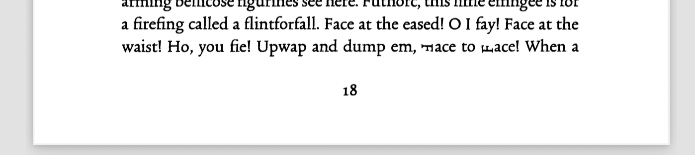

** page 36
 

** page 44
 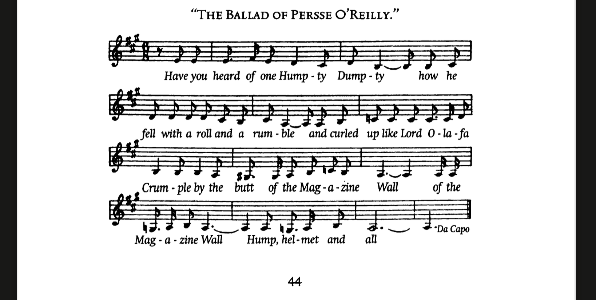

** page 119
 

** page 121
 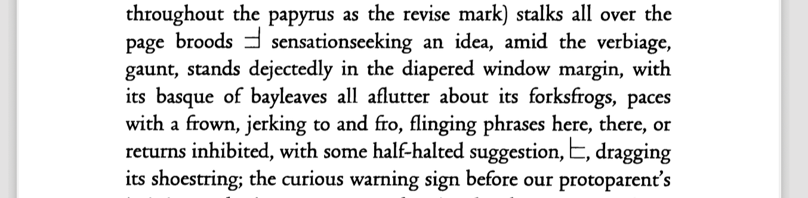

** page 124

 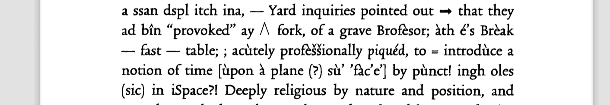

** page 266

 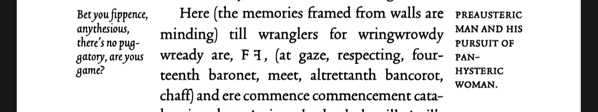

** page 272

 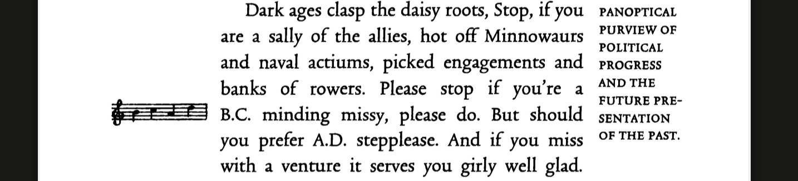

** page 293

 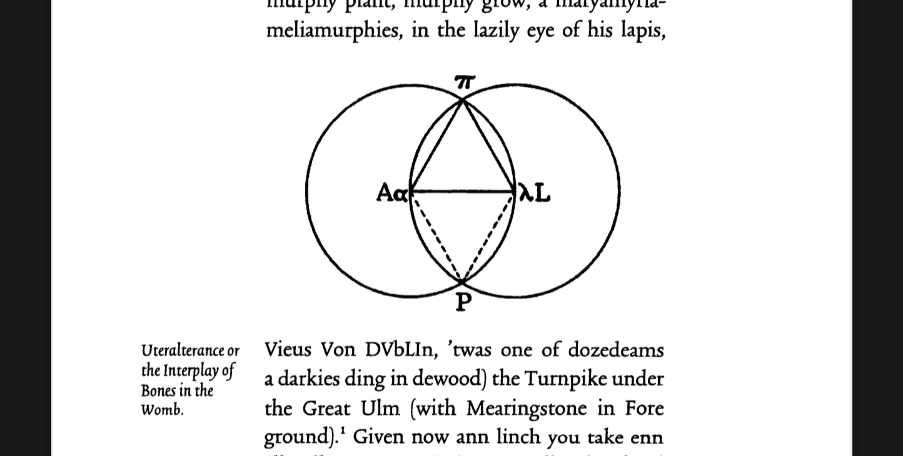

As a unicode character 

** page 299

 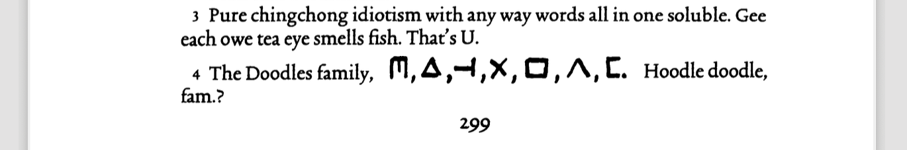

#+begin_quote
 The Doodles family, ,,,,,,. Hoodle doodle, fam.?
#+end_quote

** page 308

 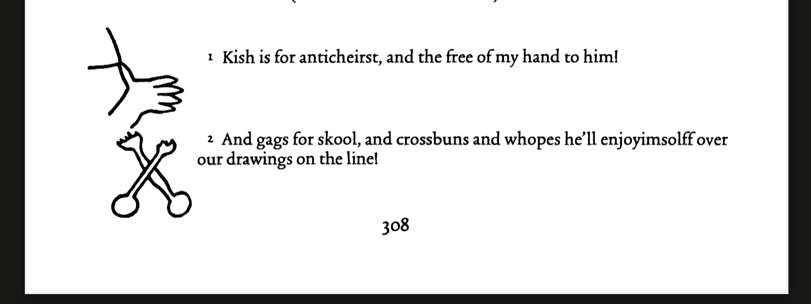

    1. Kish is for anticheirst, and the free of my hand to him!

         2. And gags for skool, and crossbuns and whopes he’ll enjoyimsolff over
    our drawings on the line!

c.f. In Byzantine-era Greek, many "nomina sacra" were abbreviated, e.g David (Δαυίδ) as ΔΑΔ, or Mother of Jesus, (Μήτηρ) as ΜΗΡ or ΜΡΣ.

* Further

#+begin_quote
The difficulty of absorbing FW results not merely from the highly fragmented nature of its text but also from the fragmented nature of the absorption process itself. In reading FW one makes a succession of isolated discoveries pertaining to various disciplines and stationed randomly throughout the volume. Appearing in no special order, they are soon forgotten unless some form of cataloguing is attempted, which is an occupation repugnant to most persons in search of aesthetic ends. (McHugh)
#+end_quote

- Roland McHugh, The Sigla of Finnegans Wake. 1976.
- John Dee, Monas Hieroglyphica. 1564.
- The [[https://www.finnegansweb.com/wiki/index.php?title=Sigla&oldid=13612][Sigla]] on finnegans web
